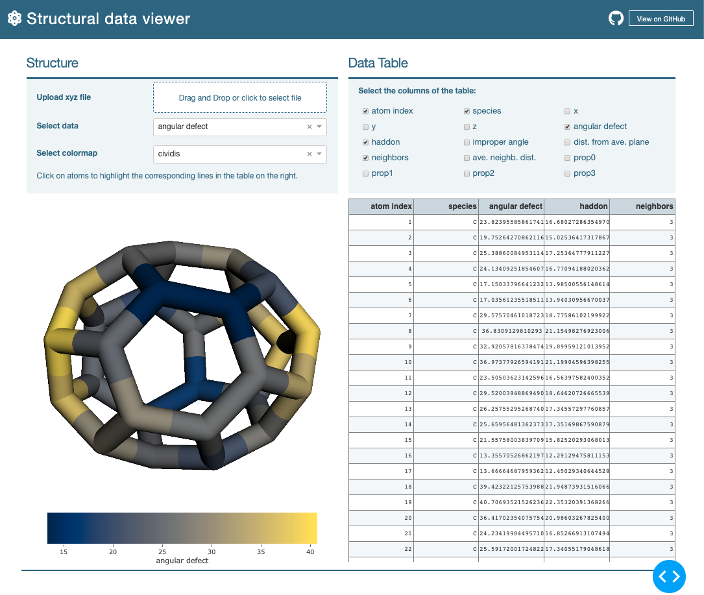

# dash-mosaica

Dash application for the Mosaica project: https://pychemapps.univ-pau.fr/mosaica/

This application aims to visualize structural data in order to provide a geometrical
analysis of a molecular structure. It also provides a way to visualize any 
atomic quantities. The application is part of the
[pychemcurv](https://github.com/gVallverdu/pychemcurv) project and will be move
soon in this repository.

## references

Julia Sabalot-Cuzzubbo, Germain Vallverdu, Jacky Cresson and Didier Bégué, Relating the
shape of a molecule and its reactivity - Haddon's Curvature and the Pyramidalization
Angle, Under review

[HAL link](https://hal.archives-ouvertes.fr/hal-02490358/file/SI-Sabalot-Vallverdu-Begue-Cresson.pdf)

## TODO

* Manage file format
* Show/Hide atom names = species + index
* Ball and stick representation
* Zoom fit the box at the beginning
