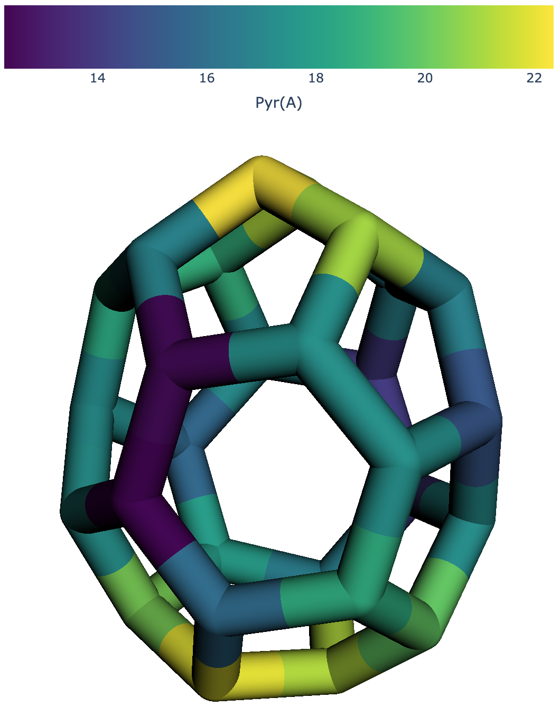

============
Introduction
============

.. contents:: Table of contents

pychemcurv is a python package for structural analyzes of molecular systems or 
solid state materials focusing on the local curvature at an atomic scale. The 
local curvature is then used to compute the hybridization of molecular orbitals.

The main features of the library are available from a 
`Plotly/Dash <https://plot.ly/dash/>`_ web application available
here `pychemapps.univ-pau.fr/mosica <https://pychemapps.univ-pau.fr/mosaica/>`_.
The webapps allows to upload simple xyz files and compute the local geometrical
properties and the hybridization properties.

    Pyramidalization angle of a :math:`C_{28}` fullerene mapped on the structure
    with a colorscale.

Features
========

Pychemcurv is divided in two parts. The first one is a standard python packages 
which provides two main classes to compute the local curvature at the atomic 
scale and the hybridization of a given atom. Second, a plotly-Dash web 
application is provided in order to perform a visualization of the structural 
analyzes on molecules or materials.

The web-application relies on the core classes of pychemcurv. Several jupyter 
notebooks are also provided as examples.

Installation
============

Before installing pychemcurv it is recommanded to create a virtual environment 
dedicated using conda or virtuelenv.

Then using pip directly from github, run

::

    pip install git+git://github.com/gVallverdu/pychemcurv.git

Alternatively, or if you want to install it in developper mode, 
you have to clone the pychemcurv repository

:: 

    git clone https://github.com/gVallverdu/pychemcurv.git

and then install the module and its dependencies in developper mode

::

    pip install -e .

In order to run the web-application locally you also need Dash and plotly. 
You can build a specific environment from ``requirements.txt`` file or 
``environment.yml`` using conda.

::

    pip install -r requirements.txt

or using ``conda``

::

    conda env create -f environment.yml
    

Citing pychemcurv
=================

Julia Sabalot-Cuzzubbo, Germain Vallverdu, Jacky Cresson and Didier Bégué, 
*Relating the shape of a molecule and its reactivity - Haddon's Curvature and 
the Pyramidalization Angle*

Licence and contact
===================

This software was developped at the `Université de Pau et des Pays de l'Adour
(UPPA) <http://www.univ-pau.fr>`_ in the `Institut des Sciences Analytiques et
de Physico-Chimie pour l'Environement et les Matériaux (IPREM)
<http://iprem.univ-pau.fr/>`_ and the `Institut Pluridisciplinaire de Recherches
Appliquées (IPRA) <http://ipra.univ-pau.fr/>`_.

**Authors**

* Germain Salvato Vallverdu: `germain.vallverdu@univ-pau.fr <germain.vallverdu@univ-pau.fr>`_
* Julia Sabalot-cuzzubbo `julia.sabalot@univ-pau.fr  <sabalot.julia@univ-pau.fr>`_
* Didier Bégué: `didier.begue@univ-pau.fr <didier.begue@univ-pau.fr>`_
* Jacky Cresson: `jacky.cresson@univ-pau.fr <jacky.cresson@univ-pau.fr>`_

|UPPA| |CNRS| |IPREM|

.. |UPPA| image:: https://www.univ-pau.fr/skins/uppa_cms-orange/resources/img/logoUPPA.png
  :target: https://www.univ-pau.fr/en/home.html
  :height: 100

.. |IPREM| image:: https://annuaire.helioparc.fr/img/2019/11/logo-9.png
  :target: https://iprem.univ-pau.fr/fr/index.html
  :height: 100

.. |CNRS| image:: http://www.cnrs.fr/themes/custom/cnrs/logo.svg
  :target: http://www.cnrs.fr/
  :height: 100

